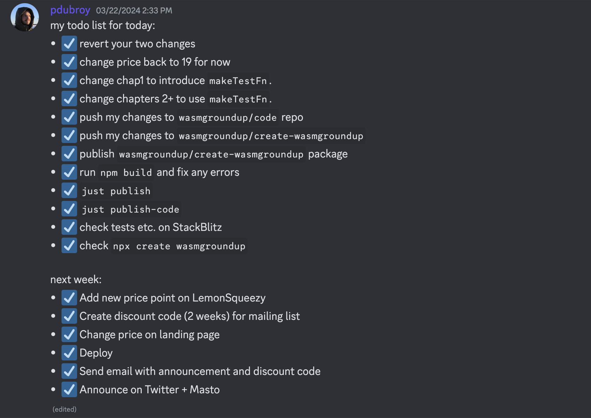

## March 23–29, 2024

### WebAssembly from the Ground Up

- Finished off the long tail of todos, and released the [next major update to the book](https://twitter.com/WasmGroundUp/status/1772632957146284462):

### Other stuff

- Published a new blog post: [Two little interpreters](https://dubroy.com/blog/two-little-interpreters/).
